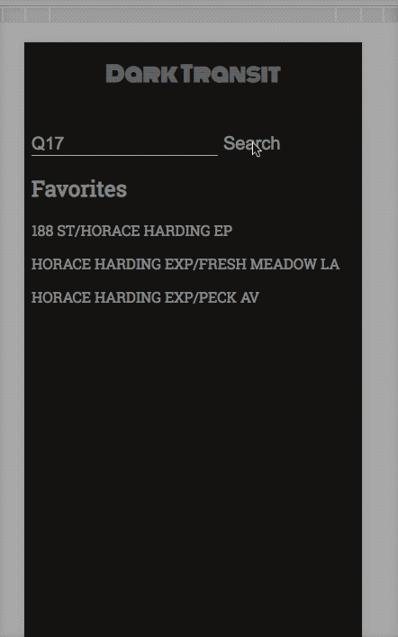
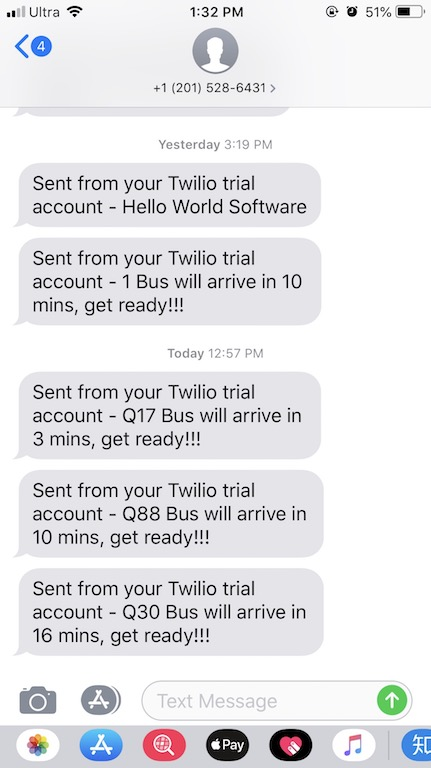

# DarkTransit

This is a Angular App for MTA bus time. I use a proxy server to provide the access the MTA BusTime API. 

## Functionalities

- Look up all bus stops and how long it takes for bus to get to that stop
- Look up detailed bus stop information.
- Favorite list for most frequently visited stops.

## Todo:
- Integrate Twillo to send SMS to user.
    - Problem faced: since bus runtime depends on the traffic and how many people are getting on/off the bus. 
    It is hard to notify the user when they have to take more than 10 minutes to get to the bus stop.
- Integrate Subway time.

## Development server

Run `npm install` in nodeapi(backend) and dark-transit(angular app) to get all dependencies.
Run `node index.js` in nodeapi folder to start the proxy server.
Run `ng serve` for a dev server. Navigate to `http://localhost:4200/`. The app will automatically reload if you change any of the source files.

## Note
Due to privacy reason, please signup for a twillo account and play with it.

